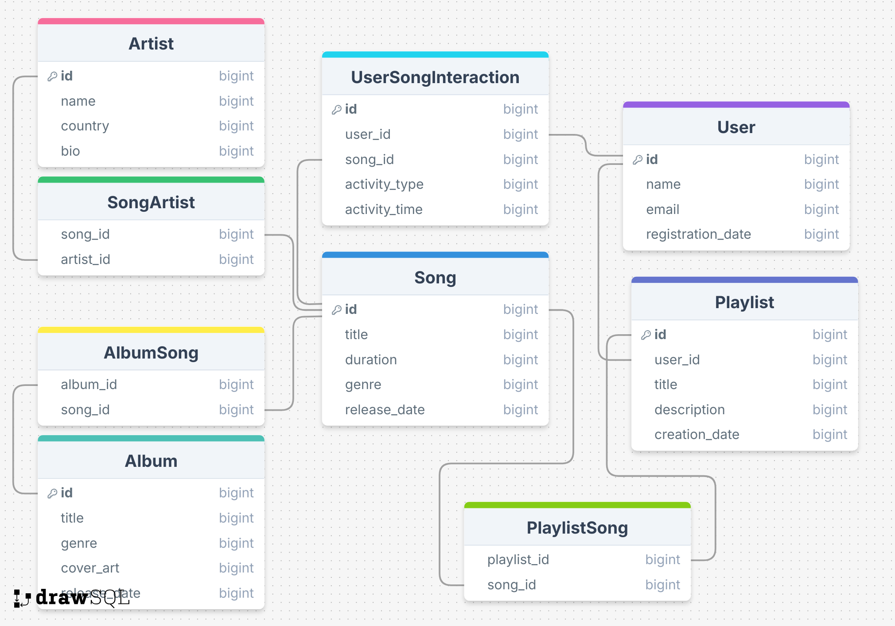

# Music App (Apple Music)

My project models a database that mimics Apple Music (or any other streaming service's) user/music database. 





## Query I thought it did well on


**Question**: Which song appears in the greatest number of playlists?

**GPT SQL Response**:
```sql
SELECT 
    s.SongID, 
    s.Title, 
    COUNT(ps.PlaylistID) AS PlaylistCount
FROM 
    Song s
JOIN 
    PlaylistSong ps ON s.SongID = ps.SongID
GROUP BY 
    s.SongID, s.Title
ORDER BY 
    PlaylistCount DESC
LIMIT 1;
```

**Friendly Response**: The song "That's What I Like" appears in the greatest number of playlists, totaling 9 appearances..


## Question that it tripped up on


Question: Which playlists contain only songs from a single genre?

**GPT SQL Response**:
```sql
SELECT 
    p.PlaylistID, 
    p.Title
FROM 
    Playlist p
JOIN 
    PlaylistSong ps ON p.PlaylistID = ps.PlaylistID
JOIN 
    Song s ON ps.SongID = s.SongID
GROUP BY 
    p.PlaylistID, p.Title
HAVING 
    COUNT(DISTINCT s.Genre) = 1;
```

SQL Result is just "IDs": [ ]

**Friendly response**: I'm sorry, but I can't determine which playlists contain only songs from a single genre based on the information provided.

I'm not exactly sure what is wrong with this SQL statement, but I specifically made sure one of my playlists only contained "pop" music, so sufficient information was certainly provided. Seems like a simple query, but my multi-shot-trained agent messed up.


## Conclusion
I found that multi-shot training provided more complex queries and joins than zero-shot did. This increased complexity (and, perhaps, computing confidence?) did not result in more accurate queries being created, however, as each learning technique yielded similar accuracy in their responses.
